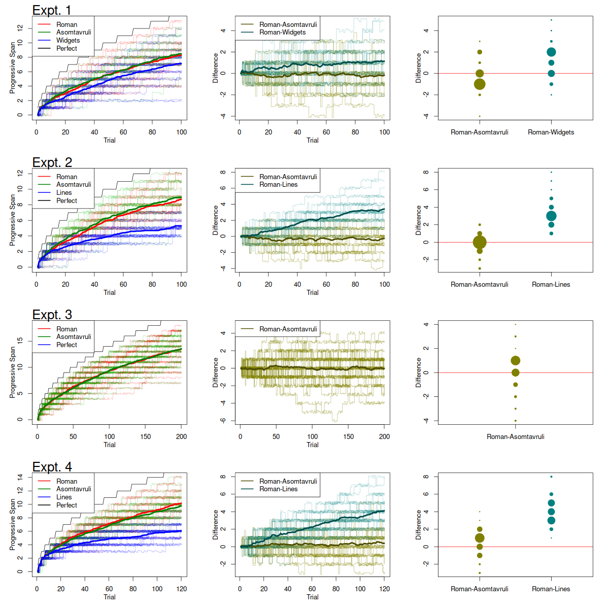

```{r libraries,echo=FALSE,message=FALSE,warnings=FALSE,include=F}
library('papaja')
library(shape)
library(BayesFactor)
knitr::opts_chunk$set(echo = FALSE, message=FALSE, warning=FALSE)
```

One surprising finding in experimental psychology is how limited people are in identifying ostensibly simple stimuli.  The classic finding is that when asked to identify a set of tones of varying frequencies, people can identify only a handful of tones perfectly no matter the range of the frequencies [@Pollack.1952] nor the degree of practice [@Shiffrin.Nosofsky.1994].  These limits stand in sharp contrast to the identification of more complex stimuli.  People are seemingly unlimited in their ability to learn new things including new objects.  This strange conjunction, that identification of simple stimuli is limited but identification of more complex ones is not, is opposite of artificial object recognition.  It is inexpensive and straightforward to design and build a machine to measure and store lengths, durations, intensities, and frequencies.  It is far more difficult to do real-world object recognition of the type humans do with great ease.

Why there are these severe limits with simple stimuli but not with complex stimuli remains an open question.  @Miller.1956 considered whether the limits in absolute judgment with simple stimuli were the same as the capacity of short-term memory.  Accordingly, more complex objects could be processed into compressed forms---chunks---while simple stimuli could not.   Yet, in our view, a more fruitful approach may be to focus on long-term storage.  Complex objects are seemingly learned in robust and stable manner, so much so that they may be named, linked with other objects and concepts, and retained on a long-term time scale, say one greater than 30 seconds or so.  Simple stimuli---those that vary in duration, volume, frequency, etc.---do not have these properties.  Current results in and leading theories of absolute identification of unidimensional stimuli stress relative judgment to previous stimuli rather than reliance on long-term representations [@Rouder.etal.2004;@Petrov.Anderson.2005;@Stewart.etal.2005].  Why complex stimuli are long-term representable but simple stimuli are not, though rarely studied, remains topical.

We will not attempt to answer this large-scale question.  Instead, we ask whether complex items benefit from having a name and known stable correlates.  For example, consider a task where a participant has to pair the Roman letter "J" with the response "73".  The letter "J" conveys meaning: it has a name pronounced *jay*, it starts the word *joy,* it comes after I and before K, etc.  The memorability of Roman letters as stimulus terms may be compared to that of equally complex but novel letters.  The middle three rows of Figure \ref{fig:stim} show *Asomtavruli* letters, which form the formal alphabet of ancient Georgia in the Caucus region.  While the Asomtavruli letters are complex stimuli that have functioned in the past as letters, they were unknown to all of our participants.  Hence, they are not familiar nor do they have stable, long-term correlates like a name, associates, or meaning.  The question we ask is whether visual complexity alone drives whether a symbol may be easily paired with response terms.  Alternatively, do other factors---the name, the meaning, the familiarity, or the stable correlates---play a role as well.  Are Roman letters easier to pair with digits than Asomtavruli letters?

```{r stim, out.width="70%",fig.cap="Stimuli.  The first three rows show 18 Roman letters.  The next three rows show derivatives of 18 Asomtavruli letters.  The final three rows show widgets, which are each composed of a single vertical and horizontal segment.  The figure shows a 3-to-1 aspect ratio of horizontal to vertical lengths.  Additionally, widgets of 1-to-1 and 1-to-3 were used."}
knitr::include_graphics("stim.pdf")
```


Before going on, we invite you, the reader, to stake out a prediction.  We think the position best represented in the literature is that these correlates should matter, though the link is somewhat tenuous and the literature is dated.    @Nobel.1952 argues that meaningful stimuli have many correlates, and these correlates themselves may be associated with the response term.   Likewise,  @McGuire.1961 theorized that there were several chains between stimulus terms and response terms.  One chain, called the *language habit*, goes as follows: The stimulus gives rise to a phonological code, which, in addition to the visual code, may be paired to the response term.  Yet, at the risk of ignoring this wisdom from the last century, it is not clear to us that any of these additional codes and correlates matter much in forming an association between a letter stimulus and a response term.


# General Method

We answer this question of whether these stable correlates matter with the following methodology, called a *progressive paired-associate span task.*  A participant is first presented a single pair, say "J-73", and then is queried with "J."  If the response is correct, "73" in this case, the set is incremented, and the next pair, say "T-42", is presented.  Once the participant has responded correctly to these two, a third pair is introduced.  To increment the set size, the participant must respond correctly to all members of the current set.  We call this process an *escalator* because it reminds us of a psychophysical staircase.  Unlike a psychophysical staircase, set sizes only increase much as an escalator goes only in one direction.  Escalators for different stimulus types, Roman and Asomtavruli letters, may be interleaved much as staircases are often interleaved.

## Stimuli.
In addition to stimulus terms of 18 Roman and Asomtavruli characters, we created two pseudo alphabets with simpler stimuli.  The first are called *widgets* (if only for a lack of a better term), and widgets are shown in the bottom three rows of Figure \ref{fig:stim}. Each character consisted of one vertical and horizontal segment whose intersection could be any point on a three-by-three grid.  In the figure, the horizontal segment is three times larger than the vertical segment.  There were actually 18 such stimuli with the other nine having the same configuration but with the vertical segment being three times larger than the horizontal segment (the inverse aspect ratio).  The second pseudo-alphabet type consisting of eighteen lines of
various lengths (these stimuli are omitted from the figure).  Line lengths are visually simpler than widgets, which, in turn, are visually simpler than Roman and Asomtavruli letters.

```{r,cache=T}
source('a.R')
sizeE1=loadE1()
sizeE2=loadE2()
sizeE3=loadE3()
sizeE4=loadE4()
```

```{r}
#makeFig(sizeE1,sizeE2,sizeE3,sizeE4)
bf1=bf(sizeE1)
bf2=bf(sizeE2)
bf3=bf(sizeE3)
bf4=bf(sizeE4)
```

```{r}
#dim(sizeE1)
```

**Experiment 1** consisted of three interleaved escalators with one each for Roman letters, Asomtavruli letters, and widgets.  Each escalator was run for 100 trials.  Twenty-seven participants from the University of Missouri Human Subjects Psychology 1 pool partook in the experiment.  As the escalators were interleaved, each participant had scores for each of the three letter types.

```{r}
#dim(sizeE2)
```
**Experiment 2** was identical to Experiment 1 except that line lengths were used instead of widgets.  Twenty seven new students from the same pool served as participants.

```{r}
#dim(sizeE3)
```
**Experiment 3** was identical to Experiment 1 except that there were two rather than three interleaved escalators, one for Roman letters and one for Asomtavruli letters.  The number of trials per escalator was increased to 200 from 100.   Thirty-six new students from the same pool served as participants.

```{r}
#dim(sizeE4)
```

**Experiment 4** was identical to Experiment 1 except that the escalators were blocked rather than interleaved.  All participants first performed a Roman-letter escalator followed by an Asomtavruli-letter escalator followed by a widget escalator.  Each of these blocked escalators were run for 120 trials.  Thirty-six new students from the same pool served as participants.

# Results

```{r dat,fig.cap="Results of four experiments.  The left column show the span as a function of trial for different stimulus types.  The middle column shows within-participant differences in spans.  The right column shows the distributions of these within-participant differences at the end of the experiment.",out.width="100%"}

```

Our main method of analysis is graphical.  Figure \ref{fig:dat} provides the results of all four experiments with one experiment per row.  The left column provides what we term the *escalator plot*.  Plotted are set sizes across trials.  The thin colored lines are individual trajectories (with some jitter added for readability) the dark colored ones are averages across participants.  The black line shows performance had learning been perfect and span unlimited.  As can be seen, the performance of participants is well below that of this perfect learner.  Note that performance seems to be nearly identical for Roman and Asomtavruli letters, and performance falls off for widget and line-length stimuli.

While the escalator plots are suggestive, they do not leverage the within-subjects nature of the design.  The center panel shows participant-by-participant differences.  The brown line shows for each participant the difference in set size between Roman and Asomtavruli escalators as a function of trial.  These curves are far more sensitive  as variation in overall learning performance is subtracted out [@Hays.1994].  Here, the average fluctuates around zero confirming the equivalence of performance.  The aquamarine lines show the difference between Roman and widget escalators (Experiment 1) or Roman and line-length escalators (Experiments 2 and 4) showing again that learning widgets and line-lengths suffered compared to Roman and Asomtavruli letters.  The plots in the right column show the distributions of differences of final spans, with the size of the points representing the proportions of participants with certain difference scores.  The equivalence of Roman and Asomtavruli letters are clearly evident in all four experiments.  

Classical statistical testing is awkward here for two reasons: First, we wish to state evidence for an invariance rather than document a lack of evidence for an effect.  Second, the critical difference scores are discrete integers without fixed limits.  A substantively motivated analysis might treat each individual-by-condition final escalator span as a Poisson random variable reflecting both condition and participant contributions.  The first issue---evidence for invariances---may be addressed with Bayes factors.  Yet, developing Bayes factors for difference of Poisson random variables in hierarchical settings is at the margins of our abilities and well outside the scope of this paper.  For rough guidance we provide the following  linear-model based Bayes factors [@Rouder.etal.2009].  Roman and Asomtavruli letters were remembered at the same rate ($B_{01}=$ `r round(1/bf1[1],1)`, `r round(1/bf2[1],1)`, `r round(1/bf3[1],1)`, `r round(1/bf4[1],1)` for Experiments 1-4, respectively).  Conversely,  Roman letters were better remembered than widgets ($BF_{10}=34$, Expt 1) and better remembered than line lengths ($BF_{10} >$  70 million for both Expt 2 and Expt 4).


# General Discussion

To our participants, Roman letters are richer than novel Asomtavruli letters in that they are associated with a name and meaningful correlates.  Even so, these additional associates did not increase the associability of Roman letters over Asomtavruli letters as both were associated with two-digit numbers at identical rates.  The simplest stimuli, the line lengths, were learned slowly and asymptoted at just a handful of items.  Widgets, which had intermediate level of visual complexity, were learned at an intermediate rate that was faster than line lengths and slower than Roman and Asomtavruli letters.  The results support the notion that the long-term storage and associability of objects is more a function of visual complexity and less a function of experience, name, or other associations.  

\newpage

# References
